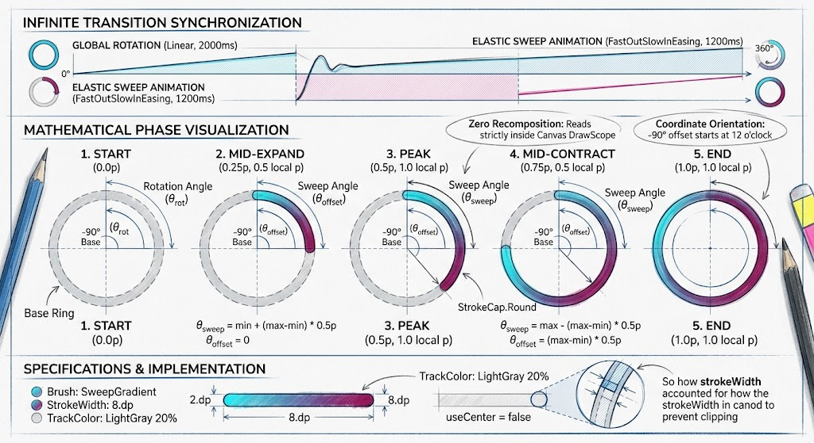

# ComposeLearning 🚀

A comprehensive playground for mastering **Jetpack Compose**, focusing on advanced animations, custom layouts, graphics, and modern Android development patterns.

## 📱 Project Overview

This project serves as a living gallery of what's possible with Jetpack Compose. It ranges from fundamental canvas operations to high-performance AGSL shaders and complex UI interactions.

### Premium Circular Progress Visualization


---

## 🌟 Key Features & Showcases

### 🎨 Graphics & Shaders
- **AGSL Shaders**: High-performance fragment shaders for effects like Page Curl (Riveo), Fluid Spring, Mesh Gradients, and Film Grain.
- **Custom Canvas**: Deep dives into `DrawScope`, paths, bezier curves, and coordinate systems.
- **Mesh Gradients**: Smooth, organic color blending using native Compose drawing.

### 🎭 Animations
- **Shared Elements**: Seamless transitions between lists and details using the latest Compose Shared Element API.
- **Physics-Based**: Spring, decay, and fling animations for realistic interactions (e.g., Tinder cards, Bouncing Ball).
- **Google Calling Animation**: A faithful recreation of the complex multi-layered Google Dialer animation.
- **Path Morphing**: SVG path interpolation for smooth silhouette transitions.

### 📐 Custom Layouts & UI
- **Apple Activity Rings**: Precise concentric ring progress with end-cap shadows and animations.
- **iPod Click Wheel**: Angular-delta based rotary scrolling interaction.
- **Clear To-Do Pinch**: A 3D "unfold" animation triggered by pinching list items apart.
- **Time Range Knob**: A circular 24h dial for selecting time ranges with draggable start/end knobs.

### 🧮 Data Structures & Algorithms (DSA) Visualizations
- **Unique Path Visualizer**: A step-by-step interactive visualization of DFS and Backtracking algorithms on a grid with obstacles.
- **Sort Animations**: Visualizing 8+ sorting algorithms (Bubble, Quick, Merge, Timsort, etc.) in real-time.

### 🌐 Modern Networking & Auth
- **Protobuf over HTTP**: Demonstrates using Protocol Buffers with OkHttp and generated Kotlin classes for efficient data transfer.
- **Passkeys (FIDO2)**: Implementation of modern passwordless authentication using the Credential Manager API.

---

## 🛠 Tech Stack

- **UI**: Jetpack Compose (1.7.0+)
- **Navigation**: Navigation3 (Experimental)
- **Image Loading**: Coil 3 (with custom SSL/OkHttp support)
- **Networking**: OkHttp, Kotlin Serialization, Protocol Buffers
- **Graphics**: AGSL (Android Graphics Shading Language)
- **Lifecycle**: ViewModel, Lifecycle-Runtime-Compose

---

## 🚀 Getting Started

1.  **Clone the repository**:
    ```bash
    git clone https://github.com/raghu-kavi/ComposeLearning.git
    ```
2.  **Open in Android Studio**: Use the latest Canary/Preview version for the best experience with experimental APIs.
3.  **Run the Protobuf Server**:
    To see the Protobuf demo in action, run the local server first:
    ```bash
    ./gradlew :server:run
    ```
4.  **Deploy to Device**: Build and run the `:app` module.

---

## 📂 Project Structure

- `:app`: The main Android application containing all UI showcases.
- `:proto-models`: Shared Kotlin/Java models generated from `.proto` definitions.
- `:server`: A small Kotlin-based desktop server for serving Protobuf data.

---

## 📜 License

```
Copyright 2024 Raghunandan Kavi

Licensed under the Apache License, Version 2.0 (the "License");
you may not use this file except in compliance with the License.
You may obtain a copy of the License at

    http://www.apache.org/licenses/LICENSE-2.0
```
