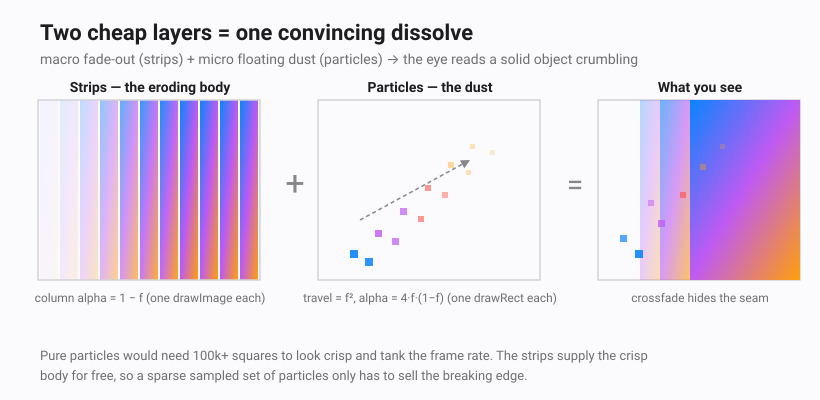
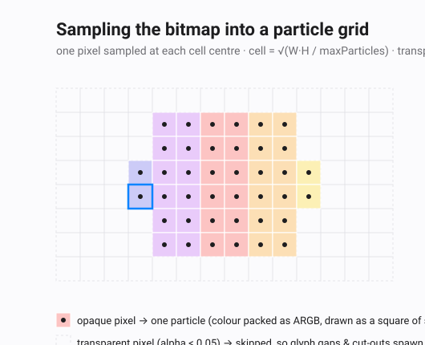
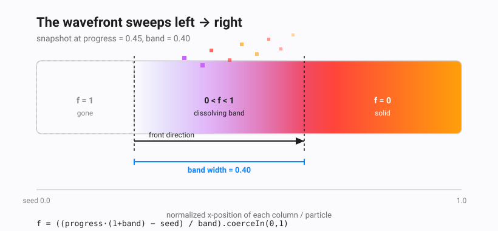
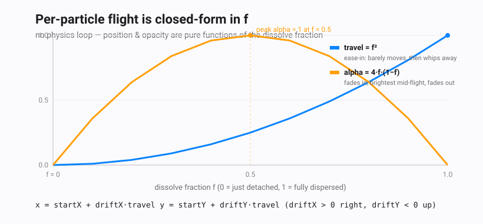

# Disintegration Effect

A reusable `Disintegration(state, content)` composable that dissolves **any** composable
— an image, text, or a whole layout — into drifting pixels ("Thanos snap" / dust dissolve).

It never inspects what it wraps. It snapshots the *rendered pixels* with a
`GraphicsLayer`, then animates that snapshot. So the same code disintegrates a photo,
a `Text("DUST")`, or a gradient card with no special handling.

```
Disintegration(state = rememberDisintegrationState()) {
    Image(painterResource(R.drawable.sample_photo), null)
}
// later…
state.trigger()   // play
state.reset()     // rebuild
```

---

## 1. The pipeline at a glance

```
                     ┌─────────────────────────── main thread ───────────────────────────┐
 content ──▶ GraphicsLayer.record { drawContent() }                                        │
                     │                                                                      │
 trigger() ─────────▶│ layer.toImageBitmap()  ──▶  ImageBitmap (the snapshot)              │
                     └──────────────────────────────────┬───────────────────────────────┘
                                                         │ withContext(Dispatchers.Default)
                     ┌───────────────────────────────────▼──────────── background ────────┐
                     │ buildEffect(bitmap):                                                 │
                     │   • toPixelMap()  (read pixels once)                                 │
                     │   • sample a grid of cells  ▶  ParticleField (parallel FloatArrays)  │
                     │   • slice width into columns ▶  List<Strip>                          │
                     └───────────────────────────────────┬──────────────────────────────┘
                                                         │
                     ┌───────────────────────────────────▼──────────── main thread ───────┐
                     │ withFrameMillis loop: progress 0f ───▶ 1f                            │
                     │ draw phase derives EVERYTHING from `progress`:                       │
                     │   drawStrips()    = the still-solid image, eroding                   │
                     │   drawParticles() = the dust flying off                              │
                     └──────────────────────────────────────────────────────────────────┘
```

Three properties this buys us, matching the design goals:

1. **Works with any composable** — we capture pixels, not semantics.
2. **Captures pixels via `GraphicsLayer`** — `record { drawContent() }` then `toImageBitmap()`.
3. **Smooth 60–120 FPS** — the only per-frame work is advancing one `Float` and redrawing
   precomputed data. All pixel reading happens once, off the main thread.

---

## 2. Capturing pixels with GraphicsLayer

`Modifier.drawWithContent` lets us intercept the draw phase. Every frame we record the
live content into a layer, so the snapshot is always current up to the instant we trigger:

```kotlin
modifier.drawWithContent {
    graphicsLayer.record { this@drawWithContent.drawContent() }   // capture
    if (!triggered) drawLayer(graphicsLayer)                       // normal draw
    else { drawStrips(...); drawParticles(...) }                  // dissolve
}
```

When `trigger()` flips `triggered`, a `LaunchedEffect` calls the **suspend**
`graphicsLayer.toImageBitmap()`. Because the layer already recorded at least one frame, the
read-back succeeds. The resulting `ImageBitmap` is the exact pixels Compose drew — at the
layer's pixel resolution, so its width/height match the `DrawScope` size 1:1. That 1:1
mapping is why strips can be drawn back at their original coordinates with no scaling.

---

## 3. Splitting the image: strips + particles



Drawing *every* pixel as an independent flying particle would be tens of thousands of draw
calls per frame. Instead the image is represented two cheap ways simultaneously:

| Primitive | What it is | Cost | Role in the animation |
|-----------|-----------|------|-----------------------|
| **Strip** | A thin vertical slice of the *original* bitmap (`drawImage` of a sub-rectangle) | One `drawImage` per slice (~hundreds) | The **still-solid image**, drawn sharp, fading column-by-column as the front passes |
| **Particle** | One sampled grid cell → a small colored square | One `drawRect` per particle (capped, ~≤4500) | The **dust** that detaches at the front and drifts away |

The strips carry the bulk of the visual fidelity for free (they're just the bitmap), while a
*sampled* subset of pixels becomes particles — enough to read as "breaking into dust" without
drawing the whole image as particles.

> **Why the illusion holds with so few particles.** Blending a *macro* fade-out (the strips) with
> *micro* floating elements (the particles) is enough to fool the eye: your brain perceives a solid
> object crumbling into dust even though the dust is quite sparse. Pure particles would need
> hundreds of thousands of squares to look crisp and would tank the frame rate; the strips supply
> the crisp body for free, so the particles only have to sell the *edge* where things break apart.

### Strips

The width is sliced into contiguous columns of `stripWidthPx` (default 3px):

```kotlin
var x = 0
while (x < w) {
    val sw = min(stripWidthPx, w - x)
    strips += Strip(x = x, width = sw, seed = (x + sw / 2f) / w)   // seed = normalized centre x
    x += sw
}
```

`seed ∈ [0, 1]` is the strip's normalized horizontal position — the single input the wavefront
math needs.

### Particles



`buildEffect` walks a grid of cells of side `cell`. The cell size is **auto-derived** so the
particle count stays under `maxParticles` regardless of image resolution:

```
cell = max( sqrt(width · height / maxParticles), 2 )
cols = ⌊width  / cell⌋
rows = ⌊height / cell⌋
```

> Solving `cols · rows ≈ (w/cell)(h/cell) = w·h/cell² ≤ maxParticles` for `cell` gives
> `cell ≥ sqrt(w·h / maxParticles)`. That keeps the draw loop bounded: a 4 MP photo and a
> 0.2 MP one both yield ≈ `maxParticles` squares.
>
> **Worked example.** A full-screen `1080 × 1920` layout is ≈ 2,073,600 px. With
> `maxParticles = 4500`: `cell = sqrt(2,073,600 / 4500) ≈ 21.4 px`. So the grid samples one pixel
> from the centre of each ≈ `21 × 21` block — skipping it if transparent, or emitting a particle if
> it has colour.

For each cell we sample the pixel at its centre. **Fully transparent pixels are skipped**
(`alpha < 0.05`), which is exactly what makes the effect work for text and irregular layouts —
the gaps around glyphs never spawn dust. Each surviving cell stores:

- `seed`   — normalized centre x, `(sx + cell/2) / w` (same coordinate space as strips)
- `startX, startY` — origin in pixels
- `driftX, driftY` — total travel vector (see §5)
- `color` — packed ARGB (`Color.toArgb()`), unpacked at draw time with `Color(int)`

Data is held in **parallel primitive arrays** (`ParticleField`), not a `List<Particle>`, to
avoid per-object allocation and keep the hot loop cache-friendly.

---

## 4. The wavefront — the core math



A single front sweeps **left → right**. For any normalized x-position `seed ∈ [0,1]`, the
**local dissolve fraction** `f` is:

```
        progress · (1 + band) − seed
f  =  ───────────────────────────────     clamped to [0, 1]
                  band
```

- `f = 0` → that column is **fully solid** (front hasn't arrived)
- `0 < f < 1` → **dissolving** (inside the moving band)
- `f = 1` → **fully gone**

`band` is the width of the front in `progress` units (default `0.40`). A column doesn't
dissolve instantly; it transitions over a window of that width, giving a soft edge.

### Why `(1 + band)` and not just `progress`?

We need two guarantees at the endpoints, for *every* `seed`:

**At `progress = 0`, nothing has dissolved.**
`f = (0 − seed)/band ≤ 0` for all `seed ≥ 0` → clamps to `0`. ✓

**At `progress = 1`, everything has dissolved.**
We need `f ≥ 1` for the *last* column, `seed = 1`:
`f = ((1)(1+band) − 1)/band = band/band = 1`. ✓

If we used plain `progress` (i.e. dropped the `1 + band`), the rightmost column would only
reach `f = (1 − 1)/band = 0` at the end — it would never dissolve. The `(1 + band)` factor
"overshoots" the sweep just enough that the trailing edge of the band clears the last column
exactly as `progress` hits 1.

Think of it as a band of width `band` whose **leading edge** is at `progress·(1+band)` and
**trailing edge** at `progress·(1+band) − band`. As `progress` goes 0→1 the leading edge
travels from `0` to `1 + band` and the trailing edge from `−band` to `1` — so the band fully
enters from the left and fully exits past the right.

Both strips and particles use this **same** `f`, which is what keeps them synchronized: a strip
fades exactly as the particles in that column come to life.

---

## 5. Rendering each frame

### Strips (the eroding image)

```kotlin
for (strip in strips) {
    val f = dissolveFraction(strip.seed, progress, band)
    val alpha = 1f - f                       // solid → transparent as the front passes
    if (alpha <= 0.001f) continue            // skip fully-dissolved columns
    drawImage(bitmap, srcOffset = (strip.x, 0), srcSize = (strip.width, h),
                      dstOffset = (strip.x, 0), dstSize = (strip.width, h), alpha = alpha)
}
```

Each column is the original bitmap faded by `1 − f`. Because adjacent strips have slightly
different `seed`, their alphas differ slightly → a smooth gradient wavefront, no shader needed.

### Particles (the dust)

```kotlin
for (i in 0 until count) {
    val f = dissolveFraction(seed[i], progress, band)
    if (f <= 0f || f >= 1f) continue         // only draw mid-flight particles

    val travel = f * f                        // ease-in: accelerate as they leave
    val alpha  = (f * (1f - f) * 4f).coerceIn(0f, 1f)   // bell curve, peak = 1 at f = 0.5
    val x = startX[i] + driftX[i] * travel
    val y = startY[i] + driftY[i] * travel
    drawRect(Color(color[i]), topLeft = Offset(x, y), size = Size(cell, cell), alpha = alpha)
}
```



**Travel — `f²`.** Quadratic easing: a particle barely moves as it detaches, then accelerates
away. Position is purely a function of `f`, so there is no integration/state to maintain between
frames — scrubbing `progress` backwards rewinds perfectly.

**Opacity — `4·f·(1 − f)`.** A parabola that is `0` at `f = 0` and `f = 1` and peaks at `1`
when `f = 0.5` (since `4·0.5·0.5 = 1`). The `×4` normalizes the peak to full opacity. Effect:
a particle *materializes* out of the image at the front, is brightest mid-flight, and *fades to
nothing* as it disperses — never a hard pop in or out.

**Brightness conservation.** Where the strip is at `alpha = 1 − f`, the particles there are
ramping up from `0`; where the strip has faded out, particles are fading too. The crossfade
hides the per-column seam so it reads as one disintegrating surface rather than a wipe.

### Drift vector (precomputed once in `buildEffect`)

```kotlin
val driftDist = max(w, h) * driftFactor       // default 0.18 of the largest side
driftX = (0.25 + rand·0.9) · driftDist        // rightward — trails the sweep direction
driftY = −(0.15 + rand·0.7) · driftDist        // upward (negative y) — dust floats up
```

The rightward bias makes dust trail the front; the upward bias makes it float like ash. The
random spread (seeded, so it's deterministic/replayable) stops the cloud from looking like a
rigid grid.

---

## 6. Driving `progress`

```kotlin
val start = withFrameMillis { it }
while (true) {
    val now = withFrameMillis { it }
    progress = ((now - start).toFloat() / durationMillis).coerceIn(0f, 1f)
    if (progress >= 1f) break
}
finish()
```

`withFrameMillis` ticks once per display frame, so playback automatically matches the device's
refresh rate (60, 90, 120 Hz). `progress` is a `mutableFloatStateOf` read inside the draw phase,
so each assignment invalidates only the draw — no recomposition, no layout. That's the whole
secret to staying smooth: **read-in-draw + analytic frame state**.

When `progress` reaches `1`, every `f = 1`: all strips skipped, all particles skipped → the
content has fully dissolved. `reset()` flips `triggered` back to `false` and the
`drawLayer(graphicsLayer)` path restores the original instantly.

---

## 7. Tuning knobs (`DisintegrationState`)

| Param | Default | Effect |
|-------|---------|--------|
| `durationMillis` | `1500` | Total play time. |
| `band` | `0.40` | Wavefront width in progress units. Bigger = softer, more gradual edge; more particles in flight at once. |
| `maxParticles` | `4500` | Caps the dust count (and so the per-frame `drawRect` count). Cell size auto-grows to honor it. |
| `particleCell` | `0` (auto) | Force a cell size in px; `0` derives it from `maxParticles`. |
| `stripWidthPx` | `3` | Slice width. Thinner = smoother front but more `drawImage` calls. |
| `driftFactor` | `0.18` | How far dust travels, as a fraction of the largest image side. |

---

## 8. Why these choices (performance notes)

- **Capture once, derive forever.** Pixels are read a single time in `buildEffect`; every frame
  thereafter is pure math over precomputed arrays.
- **Off the main thread.** `toPixelMap()` + grid sampling run under
  `withContext(Dispatchers.Default)`, so a large bitmap never janks the UI thread.
- **Bounded draw cost.** Particles are capped (`maxParticles`) and strips scale with width, not
  area. The frame budget is independent of source resolution.
- **No object churn.** `ParticleField` uses parallel `FloatArray`/`IntArray`; nothing is
  allocated during the animation loop, so there's no GC pressure to cause frame drops.
- **Stateless particles.** Position/opacity are closed-form functions of `f`, not integrated
  step-by-step — robust to dropped frames and trivially reversible.

---

## Files

- `DisintegrationEffect.kt` — `DisintegrationState`, `Disintegration`, the wavefront math,
  `buildEffect`, and the strip/particle draw helpers.
- `DisintegrationScreen.kt` — demo: switch between image / text / full-layout targets and
  play / reset the dissolve.
- `images/` — the explanatory SVG diagrams embedded above (`01-wavefront`, `02-layers`,
  `03-curves`, `04-grid`).
