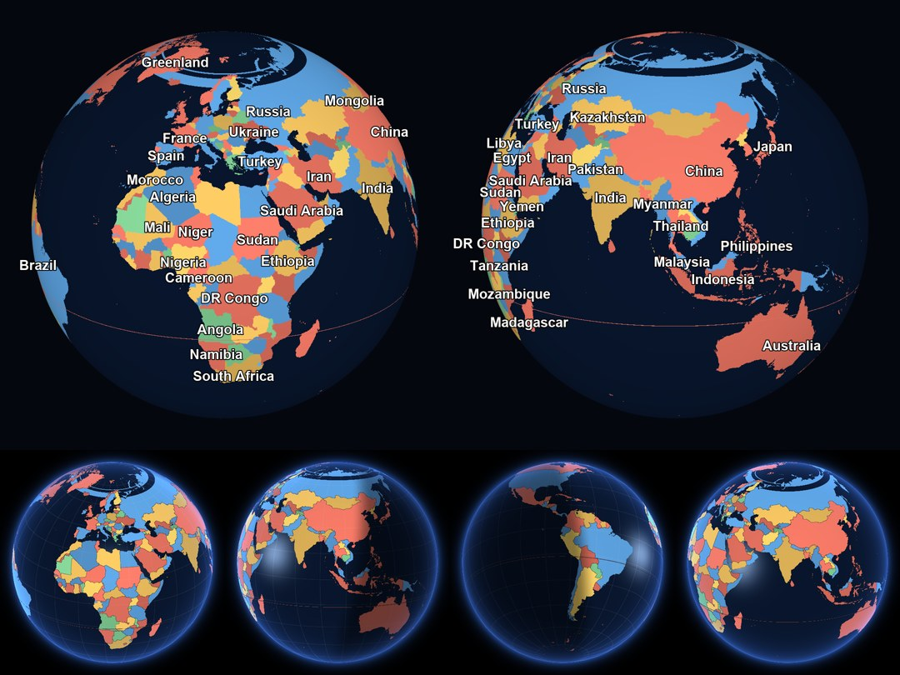

# The 3D Country Globe — Complete Maths

An orthographic, rotating Earth with **all 241 countries** individually coloured, outlined,
labelled and tappable, running at 60 fps on a phone. This document derives *every* formula
the implementation uses, in the order the pixels need them.

Nothing here is approximate hand-waving: each section ends with the exact expression that
appears in `GlobeShader.kt` / `GlobeMath.kt`, so the code and the document can be diffed
against each other.

---

## 0. Architecture, and why

There are two honest ways to draw vector countries on a sphere:

| | **A. Vector (Canvas paths)** | **B. Raster (per-pixel inverse map)** |
|---|---|---|
| Fills | must clip each polygon to the visible hemisphere, then walk the limb circle in the winding-correct direction | free — a pixel either is inside a country or isn't |
| Borders | free (stroke the path) | edge-detect the country index |
| Cost/frame | project 80 617 points, build ~1 616 paths | ~5 samples/pixel on the GPU |
| Failure mode | winding bugs at the limb, self-intersecting fills for Russia/Antarctica | texture resolution limits zoom |

Spherical polygon clipping (option A) is the classic trap: a ring that leaves the visible
hemisphere must be closed *along the limb*, and choosing the wrong direction around the limb
fills half the disc with Kazakhstan. `d3-geo` does this correctly in ~400 lines of
special-cased spherical geometry.



*Top: label placement and 4-colouring at 1080 px. Bottom: day/night terminator, ocean
specular and atmosphere. These are **reference renders** from the offline validation script —
the same formulas this document specifies, evaluated in numpy instead of AGSL, which is how
the maths was checked before a line of shader was written.*

We take **option B**, and the whole feature becomes one function:

```
pixel  ──inverse orthographic──▶  (λ, φ)  ──equirectangular──▶  texel  ──▶  country index
```

Fills, coastlines, borders, graticule, day/night and hit-testing are all consequences of
that single map. The vector data is used **only at build time**, to bake the index texture.

```
 build time (Python, once)                        run time (per frame)
 ┌──────────────────────────┐                     ┌────────────────────────────┐
 │ TopoJSON 50 m            │                     │ pixel → (λ,φ) → index      │
 │  ├ decode arcs           │   world_index.png   │  ├ palette → base colour   │
 │  ├ 4-colour the map      │ ──────────────────▶ │  ├ 4-tap Δindex → borders  │
 │  ├ rasterise (even-odd)  │   countries.json    │  ├ N·L → day/night         │
 │  └ area + label anchors  │ ──────────────────▶ │  └ rim → atmosphere        │
 └──────────────────────────┘                     └────────────────────────────┘
```

---

## 1. Notation

| Symbol | Meaning | Units |
|---|---|---|
| λ, φ | longitude (east +), latitude (north +) | radians unless marked ° |
| **n** | unit vector on the sphere ("world" frame) | — |
| λc, φc | geographic point at the centre of the disc (the camera target) | radians |
| **R** | 3×3 world→view rotation | — |
| K | sphere radius on screen = `radiusPx × zoom` | pixels |
| (u, v, w) | view-frame coordinates of a surface point, ‖(u,v,w)‖ = 1 | — |
| ρ | √(u²+v²), normalised distance from disc centre | — |
| W, H | index texture size (4096 × 2048) | texels |
| **l** | unit vector toward the sun | — |

---

## 2. The sphere: parameterisation and its inverse

Right-handed frame with **+y through the north pole** and **+z out of the screen** toward
the viewer (so the point facing the camera is the one with the largest z):

```
n(λ, φ) = ( cos φ · sin λ ,  sin φ ,  cos φ · cos λ )
```

Check the corners: `n(0,0) = (0,0,1)` faces the camera, `n(90°,0) = (1,0,0)` is to the
right, `n(·,90°) = (0,1,0)` is up. Inverting is unambiguous because the sphere is a graph
over (λ, φ) everywhere except the poles:

```
φ = asin(n_y)                       ∈ [−π/2, π/2]
λ = atan2(n_x, n_z)                 ∈ (−π, π]
```

`atan2(x, z)` — not the usual `atan2(y, x)` — because our zero meridian points along +z.
The branch cut of `atan2` sits exactly on the antimeridian λ = ±180°, which is where the
texture seam is too. §8 shows why that costs us nothing.

---

## 3. Rotation: yaw and pitch

The globe is oriented by two angles: **yaw** λc (which meridian faces us) and **pitch** φc
(which parallel faces us). We need the matrix **R** that brings `n(λc, φc)` to the centre of
the disc, i.e. to `(0,0,1)`.

**Yaw.** Rotation about the +y axis by θ:

```
        ⎡ cos θ   0   sin θ ⎤
Ry(θ) = ⎢   0     1     0   ⎥
        ⎣ −sin θ  0   cos θ ⎦
```

Apply it to `n(λ, φ)`:

```
x' = cos φ sin λ cos θ + cos φ cos λ sin θ = cos φ · sin(λ + θ)
z' = −cos φ sin λ sin θ + cos φ cos λ cos θ = cos φ · cos(λ + θ)
```

so `Ry(θ) · n(λ, φ) = n(λ + θ, φ)`: yaw is a pure **longitude shift**. To move λc to 0 we
apply `Ry(−λc)`.

**Pitch.** Rotation about the +x axis by α:

```
        ⎡ 1    0      0    ⎤
Rx(α) = ⎢ 0  cos α  −sin α ⎥
        ⎣ 0  sin α   cos α ⎦
```

On the prime meridian, `n(0,φ) = (0, sin φ, cos φ)`:

```
y' = sin φ cos α − cos φ sin α = sin(φ − α)
z' = sin φ sin α + cos φ cos α = cos(φ − α)
```

a pure **latitude shift**: `Rx(α) · n(0, φ) = n(0, φ − α)`. To move φc to 0 we apply
`Rx(φc)`. Order matters — longitude first, then latitude:

```
R = Rx(φc) · Ry(−λc)

    ⎡  cos λc            0        −sin λc          ⎤
R = ⎢ −sin φc sin λc   cos φc    −sin φc cos λc    ⎥
    ⎣  cos φc sin λc   sin φc     cos φc cos λc    ⎦
```

Two facts worth internalising:

1. **Row 2 of R is `n(λc, φc)ᵗ`** — the view direction. Therefore for any point,
   `w = row₂ · n = cos(angular distance from the disc centre)`. Visibility, fading, area
   foreshortening and label priority all reduce to this one dot product.
2. **R is orthonormal**, so `R⁻¹ = Rᵗ`. The inverse map costs a transpose, not a solve.

Verification that R does its job:

```
R · n(λc,φc) = ( 0, 0, cos²φc + sin²φc ) = (0, 0, 1)   ✓
```

---

## 4. Forward projection (used for labels and hit-test seeding)

Orthographic projection = drop the z coordinate. With the disc centre at `(cx, cy)` pixels
and screen y pointing down:

```
(u, v, w) = R · n
screen_x  = cx + K · u
screen_y  = cy − K · v          (sign flip: maths-up vs screen-down)
visible   ⟺ w ≥ 0
```

No perspective divide: an orthographic camera is at infinity, which is *right* for a globe —
it is exactly what a sphere looks like from far away, and it keeps the silhouette a perfect
circle of radius K, which the next section depends on.

**Silhouette anti-aliasing.** The disc edge is the curve ρ = 1. One pixel is `1/K` in
normalised units, so a half-pixel-accurate coverage term is

```
α_disc = clamp( (1 − ρ) · K + 0.5 , 0, 1 )
```

**Area foreshortening.** The Jacobian of an orthographic projection of the sphere has
determinant `w`: a patch of solid angle `A` steradians at angular distance `θ = acos w`
covers

```
A_screen = A · w · K²  pixels²          (1)
```

This is the whole of §15's label logic, derived for free.

---

## 5. Inverse projection (the per-pixel core)

Given a pixel, walk backwards:

```
u = (px − cx) / K
v = (cy − py) / K
ρ² = u² + v²
if ρ² > 1  →  the pixel misses the sphere (space / atmosphere halo)
w = √(1 − ρ²)                                   (2)
n = Rᵗ · (u, v, w)
```

Written out with `Rᵗ` (columns of R), and then simplified:

```
n_y = cos φc · v + sin φc · w
n_x = cos λc · u + sin λc · (cos φc · w − sin φc · v)
n_z = −sin λc · u + cos λc · (cos φc · w − sin φc · v)
```

Both `n_x` and `n_z` contain the same combination `q = cos φc · w − sin φc · v`, so:

```
φ = asin( v cos φc + w sin φc )
λ = λc + atan2( u , w cos φc − v sin φc )        (3)
```

This is Snyder's inverse orthographic (*Map Projections — A Working Manual*, 1987, eqs.
20-14/20-15) with `sin c = ρ`, `cos c = w`. Deriving it as `Rᵗ` instead of trigonometrically
means the shader can carry the three rows of R as uniforms and generalise to a third
rotation (roll) without new algebra.

Per pixel this is: 1 `sqrt`, 1 `asin`, 1 `atan2`, ~10 multiply-adds.

---

## 6. The Jacobian: how big must the texture be, and why offsets must be in screen space

Differentiate (2) and (3). From `w = √(1 − u² − v²)`:

```
∂w/∂u = −u/w        ∂w/∂v = −v/w                 (4)
```

so, with `∂u/∂px = 1/K` and `∂v/∂py = −1/K`,

```
∂φ/∂px = (1/K) · ( −u sin φc ) / ( w cos φ )
∂φ/∂py = (1/K) · ( v sin φc / w − cos φc ) / cos φ
∂λ/∂px = (1/K) · ( q + u²/w · … ) / (u² + q²)          q = w cos φc − v sin φc
```

The exact λ derivatives are longer, but the structure is all that matters:

> **Every term carries a factor 1/K, and every term carries a factor 1/w.**

Two consequences drive real design decisions.

### 6a. Texture resolution

At the disc centre (`w = 1`, `φ = φc`) the scale is `1/K` radians per pixel. The texture has
`W/2π` texels per radian of longitude. Demanding at least one texel per pixel:

```
W / 2π  ≥  K        ⟹        W ≥ 2π K                (5)
```

Obvious in hindsight — the equator is `2πK` pixels long on screen, so the texture needs at
least that many texels around it. Concretely, with `W = 4096`:

```
K_max = 4096 / 2π ≈ 652 px
```

A 200 dp globe (K ≈ 200·2.75 ≈ 550 px on a 2.75× device at zoom 1) is comfortably inside
that, and zoom is clamped so that `K ≤ 652` (§13) — the zoom limit is *derived*, not
guessed. Texel pitch is `360°/4096 = 0.0879°`, i.e. **9.8 km at the equator**.

### 6b. Sampling offsets belong in screen space

Because the Jacobian blows up as `1/w`, a *fixed* offset in texture space (the natural way
to write an edge detector) maps to a screen-space width that grows without bound toward the
limb: borders would be hairlines at the centre and fat smears at the rim. Detecting edges by
offsetting **in pixels** and inverse-projecting each tap instead gives constant-width lines
everywhere, with zero Jacobian bookkeeping. The cost is 4 extra inverse projections per
pixel; the GPU does not care.

---

## 7. The index texture

An equirectangular (plate carrée) raster, `W × H = 4096 × 2048`, storing a *country id*, not
a colour:

```
s = ( λ/2π + 0.5 ) · W          λ ∈ (−π, π]
t = ( 0.5 − φ/π ) · H           φ ∈ [−π/2, π/2]
id = round( 255 · tex(s, t).r )         0 = ocean, 1…241 = country
```

Three properties make this work:

- **Nearest-neighbour filtering is mandatory.** Bilinear interpolation of *ids* would invent
  countries: halfway between id 7 and id 19 lies id 13. `BitmapShader.setFilterMode(NEAREST)`.
- **The `round(255·r)` is deliberately tolerant.** Any 8-bit channel round-trip error (colour
  management, premultiplication) is ±1/255 at worst; rounding absorbs it.
- **Tile mode is REPEAT in x, CLAMP in y.** The seam at λ = ±180° — the `atan2` branch cut —
  therefore joins texel `W−1` to texel `0` exactly, with no interpolation across it. The
  poles clamp: the top texel row spans 89.956°…90°, stretched over the pole. The north pole
  is ocean and the south pole is the interior of Antarctica, so the stretch is invisible.

Colour comes from a second, tiny texture: a `256 × 1` palette where texel *i* holds the
colour of country *i*, built at load time from `countries.json`. Recolouring the map
(selection highlight, colour-blind palettes, "all land one colour") is then a 1 KB upload,
not a re-bake.

The two textures are bound with **different APIs on purpose**:

| Texture | Binding | Why |
|---|---|---|
| index raster | `RuntimeShader.setInputBuffer` | samples the bitmap as *raw data* — no colour-space conversion, so an id survives the trip intact |
| palette | `RuntimeShader.setInputShader` | these are real colours and *should* be colour-managed like everything else on the canvas |

Getting this backwards is the subtle failure mode: a colour-managed index texture can shift
`id` by a least-significant bit or two and repaint Chad as Chile.

---

## 8. Borders and coastlines: screen-space index differencing

For a pixel `p`, sample the id at `p` and at four taps offset by `b` pixels:

```
ids: c = id(p),  and  id(p ± (b,0)),  id(p ± (0,b))
coverage = ( Σ [ id(tap) ≠ c ] ) / 4          ∈ {0, ¼, ½, ¾, 1}
colour   = mix( fill, borderColour, coverage )
```

with `b ≈ 0.8 px`. Notes:

- Comparing **ids**, not colours, is what makes two same-coloured neighbours still show a
  border. (It also means the 4-colouring of §17b is purely cosmetic — correctness does not
  depend on it.)
- Land-vs-ocean is the same test, so **coastlines come out of the identical branch** as
  political borders. One code path, two visual features.
- The `coverage` fraction is a cheap 4-tap anti-alias: diagonal borders get a soft edge
  instead of a staircase.
- Taps that fall outside the disc (`ρ > 1`) are treated as *equal* to the centre id, so no
  hard ring is drawn around the silhouette — the limb already reads as an edge thanks to the
  atmosphere term (§11).

The same trick draws the **graticule**. Define cell indices at a step Δ (15°):

```
cλ(p) = floor( λ(p) / Δ )        cφ(p) = floor( φ(p) / Δ )
```

and mark the pixel if any of the four taps disagrees with the centre on either index. The
result is a constant-width lat/lon grid whose meridians *automatically* converge at the
poles: on screen, adjacent meridians are `K Δ cos φ` pixels apart, which → 0 as φ → ±90°.
No trigonometry in the shader, just differencing.

---

## 9. Lighting: Lambert, with a real sun

Diffuse shading needs the surface normal, and on a unit sphere **the normal is the position**:
`n̂ = n`. So the day factor is one dot product:

```
d = n · l
```

`l` is the unit vector toward the sun, computed from the **subsolar point** (λs, φs) — the
place where the sun is exactly overhead — via `l = n(λs, φs)`. The standard NOAA
approximation, with `N` = day of the year and `t_UTC` = hours UTC:

```
γ  = 2π/365 · ( N − 1 + (t_UTC − 12)/24 )                            fractional year

δ  = 0.006918 − 0.399912 cos γ + 0.070257 sin γ
             − 0.006758 cos 2γ + 0.000907 sin 2γ
             − 0.002697 cos 3γ + 0.001480 sin 3γ                     declination, rad

EoT = 229.18 · ( 0.000075 + 0.001868 cos γ − 0.032077 sin γ
               − 0.014615 cos 2γ − 0.040849 sin 2γ )                 equation of time, min

φs = δ
λs = −15° · ( t_UTC + EoT/60 − 12 )                                  subsolar longitude
```

`φs = δ` because "the sun is overhead" *is* the definition of declination; the longitude
formula is just "the sun crosses 15° of longitude per hour, corrected by the equation of
time" — the orbital-eccentricity + axial-tilt wobble that makes solar noon drift ±16 minutes
across the year. This is why the terminator in the app leans correctly for today's date
instead of being a vertical line.

**Terminator softness.** A hard `d > 0` test gives a razor edge; real twilight spans a few
degrees of angle. With a twilight half-width `τ` (≈ 6° ⟹ `sin τ ≈ 0.105`):

```
day = smoothstep( −sin τ , +sin τ , d )
```

**Limb darkening** (optional, sells the sphere): multiply the lit colour by
`0.55 + 0.45 · w^0.4`, darkening the geometric edge where the surface turns away.

**Ocean specular.** Water gets a Blinn-Phong lobe. Work in the *view* frame, where the eye
direction is exactly `e = (0,0,1)`:

```
l_view = R · l
h      = normalise( l_view + e )
spec   = pow( max( (u,v,w) · h , 0 ) , 48 ) · oceanMask · day
```

The half-vector form is used rather than reflect-and-dot because it costs one add and one
normalise, and for an orthographic camera `e` is constant, so `h` is constant per frame —
it could even be a uniform.

---

## 10. Atmosphere

Two terms, both functions of `ρ` alone.

**Inner rim** (inside the disc): the sphere's surface turns edge-on as `w → 0`, so a
Fresnel-like power of the grazing factor tints the rim:

```
rim = pow( 1 − w , 3 )          colour += rim · skyBlue · day
```

**Outer halo** (outside the disc, `ρ > 1`): the shader is drawn over a rect larger than the
disc, so there are real pixels to put glow into. An exponential falloff over a band of
thickness `g` (≈ 0.12 in ρ units) reads as air:

```
α_halo = exp( −(ρ − 1) / (g/3) ) · A_halo · (0.35 + 0.65 · dayAtLimb)
```

Anchoring the halo brightness to the day factor at the nearest limb point keeps the glow on
the sunlit side, which is the detail that makes it look photographed rather than drawn.

---

## 11. Gestures

### 11a. Drag → yaw/pitch

At the disc centre, the surface is parallel to the screen and moving the finger by `Δpx`
pixels sweeps an arc of `Δpx / K` radians (arc length = radius × angle, and the radius on
screen *is* K). So:

```
λc ← λc − Δpx / K
φc ← φc + Δpy / K              (screen y is down, latitude is up)
φc  clamped to ±85°
```

The clamp is not cosmetic: at `|φc| = 90°` the pole faces the camera, `R` becomes
degenerate in the sense that yaw no longer changes anything visible (it spins the disc about
its own centre), and the user loses the ability to steer.

This mapping is exact only near the centre; by §6 the same pixel delta near the limb
corresponds to `1/w` times more angle, so a finger on the rim drags "slower" than the
surface under it. The alternative is a **grab-the-globe** solve: remember the geographic
point `n₀` picked up at drag start and solve `R(λc, φc) · n₀ = (u, v, ·)` for the two
unknowns each frame. It is closed-form solvable but

- it is not always solvable (the grabbed point may be unreachable under the pointer, e.g. a
  tropical point dragged toward the screen corner), and
- it is ill-conditioned exactly where the naive map is inaccurate (near the limb, where a
  pixel is worth `1/w` radians).

A predictable 1/K map that never fights the user beats an exact map that occasionally jumps.

### 11b. Fling, and blending back into auto-spin

Release with angular velocity `ω₀` (rad/s, from the pointer velocity ÷ K). Friction is
proportional to speed, so `ω̇ = −ω/τ` and

```
ω(t) = ω_spin + (ω₀ − ω_spin) · e^(−t/τ)
```

which decays to the idle auto-spin rate `ω_spin = 2π / 60 s` instead of to zero — the globe
never comes to a dead stop, it just resumes its slow turn. Total extra sweep of a fling is
`∫(ω − ω_spin) dt = (ω₀ − ω_spin) · τ`, i.e. finite and predictable: with `τ = 0.9 s`, a
6 rad/s flick buys ~5.4 rad ≈ 310° of extra spin. Per frame with timestep `Δt`:

```
ω ← ω_spin + (ω − ω_spin) · exp(−Δt/τ)
λc ← λc + ω · Δt
```

Using `exp(−Δt/τ)` rather than a fixed multiplier makes the decay frame-rate independent —
identical motion at 60, 90 and 120 Hz.

### 11c. Zoom

Pinch multiplies K. The upper clamp comes straight from (5):

```
zoom ∈ [1, min(z_max, 4096 / (2π · radiusPx))]
```

so the globe can never be magnified past the point where the texture becomes visibly blocky.

---

## 12. Hit-testing a tap

Reuse §5 exactly: inverse-project the tap to (λ, φ), convert to texel coordinates, read the
id from the CPU-side copy of the bitmap. `O(1)`, no point-in-polygon, no spatial index —
and it agrees with what the user *sees* by construction, since it is literally the same
function the shader used to colour that pixel.

One refinement: microstates (Vatican, Monaco, Nauru) are a single texel wide, and coastlines
are jagged at 9.8 km. A tap that lands on ocean therefore searches outward in a spiral over
a small radius (≤ 12 px) and takes the first non-zero id:

```
for r in 1..12:  for θ in 0..(8r) steps:  test pixel (px + r cos θ, py + r sin θ)
```

which makes every one of the 241 countries reachable with a fingertip.

---

## 13. Labels

Given each country's precomputed anchor `n_i` (§17c) and spherical area `A_i` (§17d):

```
w_i = row₂(R) · n_i = cos(angular distance from disc centre)
```

**Visibility.** `w_i > ε`, with `ε = 0.12` (≈ 83° from the centre) so labels never crawl on
the extreme limb where they would be unreadable and unstable.

**Fade.** `α_i = smoothstep(0.12, 0.35, w_i)` — a country's name fades up as it rotates into
view, which is the behaviour that makes the rotation feel like a globe rather than a slideshow.

**Priority.** From (1), a country of area `A_i` at foreshortening `w_i` occupies
`A_i w_i K²` pixels², so its linear screen extent is

```
ℓ_i ≈ K · √( A_i · w_i )      pixels
```

Sort labels by `ℓ_i` descending and only place a label at all if `ℓ_i > 12 dp` (≈ 34 px on a
3× screen — the threshold is in **dp**, or a dense phone would show twice the labels of a
cheap one at the same physical size). This single expression handles both "Russia beats
Luxembourg" and "a country near the limb loses to one facing us", because both effects are
already in it.

Measured at 1080 px with these constants, a view centred on Africa places 24 labels —
Russia, Algeria, DR Congo, India, Sudan, Saudi Arabia, China, Brazil, … — in descending size,
with Brazil arriving at α ≈ 0.04 as it rounds the limb.

**Collision.** Greedy: walk the sorted list, accept a label if its padded text rect intersects
no already-accepted rect and lies inside the viewport, else drop it; cap at 24 labels. Greedy
is the right choice over a global optimum here because the priority order is *stable* under
small rotations, so labels don't flicker between frames as they would if a solver re-shuffled
assignments each frame. The selected country is inserted first, so it always gets its name.

---

## 14. Build-time maths

### 14a. TopoJSON decoding

Natural Earth 1:50 m via `world-atlas@2/countries-50m.json`: 241 countries, 1 616 polygons,
1 959 **arcs**, 80 617 points. Coordinates are quantised integers, delta-encoded along each arc:

```
x_k = Σ_{j≤k} dx_j ,        λ_k = x_k · scale_x + translate_x
y_k = Σ_{j≤k} dy_j ,        φ_k = y_k · scale_y + translate_y

scale = (0.0036000360, 0.0017360035)     translate = (−180, −89.999)
```

`scale_x = 360/99999`: the source was quantised to a 10⁵ grid, giving 0.0036° ≈ 400 m — four
times finer than our 9.8 km texel, so the raster is limited by *our* choice, not the data.

Arcs are **shared**: a border between two countries is stored once, and referenced as `+a`
by one and `~a = −a−1` by the other (reversed). Two facts follow, both used below: the
polygons are watertight by construction, and adjacency is free.

No line simplification is applied. Douglas–Peucker at 0.05° would cut 80 617 points to
26 808, but simplification only pays off when points are *projected per frame* — we
rasterise once at build time, so we may as well use every point.

### 14b. Four-colouring the map

Two countries are adjacent iff they reference the same arc index (one as `+a`, the other as
`~a`). That gives the adjacency graph directly from the topology — no geometric intersection
tests. Then greedy DSATUR (colour vertices in order of decreasing *saturation* = number of
distinct colours already among their neighbours, breaking ties by degree) assigns each
country a small colour class.

The four-colour theorem guarantees 4 suffice for a planar map, and this map is *not* planar in
the theorem's sense — exclaves (Alaska, Kaliningrad, French Guiana) make a single "country" a
disconnected region, which can force a fifth colour. In the event DSATUR lands on exactly
**4 classes** for all 241 units (the densest vertex has 17 neighbours), so the theorem's bound
holds here anyway. Since §8 detects borders from **ids** rather than colours, none of this
affects correctness — two same-class countries that happen to touch would still be separated
by a drawn border. A per-id hash also nudges each country's brightness, so same-class
neighbours-of-neighbours don't read as one landmass.

### 14c. Label anchors: pole of inaccessibility

A centroid is the wrong anchor — the area centroid of Croatia, Vietnam or Norway falls
outside the country. What we want is the *pole of inaccessibility*: the centre of the largest
inscribed circle,

```
p* = argmax_{p ∈ P}  dist(p, ∂P)
```

Rather than solve that on the vector rings (polylabel-style grid refinement), we solve it on
the raster we just baked, which is both simpler and better behaved: repeatedly apply a
4-neighbour binary **erosion** to the country's mask and keep the last non-empty layer. Since
each erosion peels exactly one texel of city-block distance off the boundary, the final layer
is the set of deepest interior texels — and it costs one `numpy` shift per unit of depth.

Two properties fall out for free:

- **Multi-part countries need no special case.** The thickest region wins, so Alaska does not
  drag the USA's label into the Pacific and archipelagos label their largest island.
- **The anchor is a texel that really belongs to the country**, so it can never land offshore.
  This matters: the naive "centre of the deepest layer" *can* fall outside, because that layer
  may have several disconnected components (Bolivia and Panama both do). Taking the mean and
  then **snapping to the nearest texel of the layer** fixes it. All 241 anchors are verified
  to lie inside their own country.

Anchors are stored as (λ, φ) and the runtime only ever converts them with `n(λ, φ)`.

### 14d. Spherical area

For label priority (§13) we need real solid angle, not projected pixels. For a spherical
polygon with vertices (λ_k, φ_k), Green's theorem on the sphere gives

```
A = ½ | Σ_k (λ_{k+1} − λ_k) · (2 + sin φ_k + sin φ_{k+1}) |     steradians
```

with `λ_{k+1} − λ_k` taken as the *shortest* signed difference (so antimeridian-crossing
edges don't contribute a spurious 2π), and holes contributing with opposite sign because
their winding is reversed. Multiply by `R_earth² = 6 371²` km² for real areas — the app
displays these in the selection card.

### 14e. Rasterisation

Per polygon, scanline fill with the **even-odd** rule over *all* its rings at once, which
punches holes automatically (Lesotho inside South Africa, San Marino and Vatican inside
Italy) because a hole's winding is reversed.

Draw order matters: **descending area**. A hole punched by South Africa must be filled in
afterwards by Lesotho, so the enclosed country has to be drawn *later*. Sorting by area
descending guarantees it, since an enclosed country is necessarily smaller than its enclosing
one.

Anti-aliasing is deliberately **off**: an averaged id is a meaningless id. Edge smoothing is
done at render time in screen space (§8), where it belongs.

**Sub-texel countries.** At 0.0879°/texel, Vatican City is ≈ 0.02° across — smaller than a
texel — so nothing guarantees it survives rasterisation, and "all 241 countries" quietly
becoming 226 (with untappable microstates) would be a lie. After the fill pass, any country
holding **zero** texels therefore gets a 2-texel disc stamped at its label anchor.

In practice the net never catches anything: at both 4096 and 2048 widths all 241 ids come out
present, because the polygon filler keeps at least one pixel for a degenerate ring. Vatican
City ends up as 1 texel, Monaco 3, San Marino 4, Singapore 10 — quantised, but real, coloured,
labelled and tappable.

---

## 15. Budget

**Per pixel** (5 inverse projections: centre + 4 border taps):

| Op | Count |
|---|---|
| `sqrt` | 5 |
| `asin` / `atan2` | 5 + 5 |
| texture fetches | 5 (index, nearest) + 1 (palette) |
| multiply-add | ~90 |

At 1080 × 1080 covered pixels that is ~1.2 M transcendental ops per frame — trivial for a
mobile GPU, which is why per-pixel wins over per-vertex here despite doing "more maths".

**Memory:** `4096 × 2048 × 4 B = 33.5 MB` for the ARGB_8888 index bitmap; the PNG on disk is
an 8-bit greyscale image and only **96 KB**, because a political map is enormous flat regions
and PNG's filters love those. The bitmap is loaded once and kept CPU-readable for §12, and it
is *not* explicitly recycled — the `BitmapShader` handed to the GPU still references it, so
release is left to GC when the screen leaves composition. Re-baking at
`--width 2048` costs 4× less memory and caps K at 326 px by (5) — the one knob to turn if a
device is tight.

**Precision:** all shader maths is `half`-safe except the longitude reconstruction; `atan2`
near the seam and `asin` near the poles are evaluated in `float`. Latitude resolution of a
32-bit float at φ ≈ 0 is ~10⁻⁷ rad ≈ 0.6 m, six orders of magnitude below a texel.

---

## 16. Files

| File | Role |
|---|---|
| `GLOBE.md` | this document |
| `GlobeShader.kt` | the AGSL program: §5, §7–§10 |
| `GlobeMath.kt` | rotation, forward/inverse projection, hit-test, label layout: §3–§4, §12–§13 |
| `GlobeState.kt` | yaw/pitch/zoom, spin, fling: §11 |
| `GlobeView.kt` | the composable: uniforms per frame + label drawing |
| `GlobeScreen.kt` | route, controls, selection card |
| `data/WorldAtlas.kt` | asset loading, palette texture, country table |
| `tools/globe/build_globe_assets.py` | §14, the offline bake |
| `assets/globe/world_index.png` | 4096 × 2048 country-id raster |
| `assets/globe/countries.json` | 241 × { id, name, anchor, area, colour class } |

Data: Natural Earth 1:50 m (public domain) via
[`world-atlas`](https://github.com/topojson/world-atlas) (ISC).
