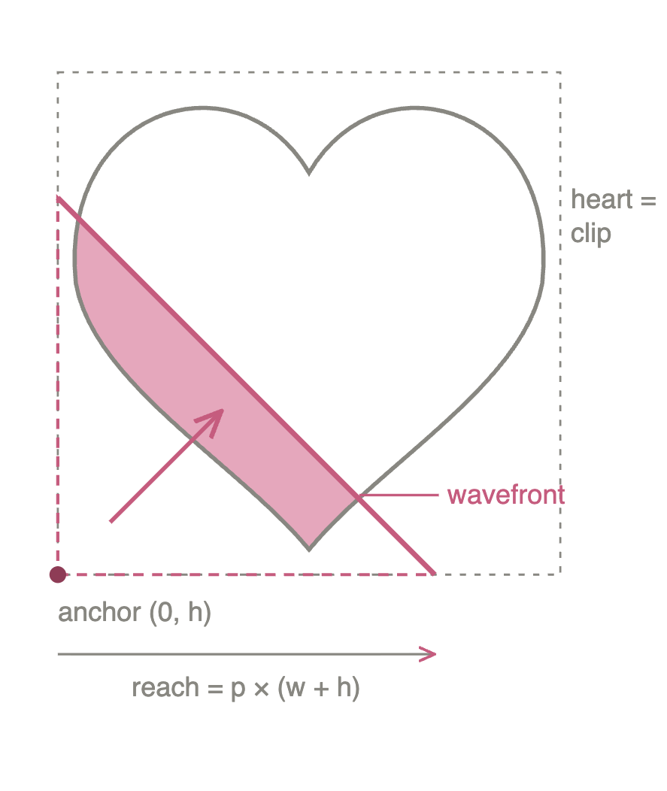

# Gradient Heart Fill

A heart built from cubic Béziers, painted with a diagonal linear gradient, and
revealed by a wavefront that sweeps from the bottom-left corner to the top-right.
Implementation: [GradientHeartFill.kt](GradientHeartFill.kt).



The effect is three independent layers — geometry, color, and reveal — composed in
a single `Canvas` draw pass:

```
clipPath(heart) {
    drawPath(revealTriangle, gradient)
}
```

---

## 1. The heart geometry

The heart lives in a `w × h` bounding box and is built from **four cubic Bézier
segments** — two per lobe, with the right side mirroring the left about the
vertical axis `x = w/2`. A cubic Bézier

```
B(t) = (1−t)³·P₀ + 3(1−t)²t·C₁ + 3(1−t)t²·C₂ + t³·P₁ ,  t ∈ [0, 1]
```

is defined by a start point `P₀`, end point `P₁`, and two control points `C₁`,
`C₂` that the curve is pulled toward but never touches.

| Segment | From → To | C₁ | C₂ |
|---|---|---|---|
| Left lobe | notch `(w/2, h/5)` → left edge `(w/28, 0.42h)` | `(0.36w, −h/25)` | `(0, h/15)` |
| Left flank | left edge → bottom tip `(w/2, 0.95h)` | `(w/14, 0.62h)` | `(0.36w, 0.78h)` |
| Right flank | bottom tip → right edge `(27w/28, 0.42h)` | `(0.64w, 0.78h)` | `(13w/14, 0.62h)` |
| Right lobe | right edge → notch | `(w, h/15)` | `(0.64w, −h/25)` |

Notes on the numbers:

- The path starts at the **notch** between the lobes, `(w/2, h/5)`, and travels
  counter-clockwise around the left side first.
- The lobe control points sit slightly **above** the box (`y = −h/25`). The curve
  itself stays inside, but pulling the controls past the top edge is what makes
  the lobes read as round domes instead of flat-topped arcs.
- Every right-side control point is the left-side one reflected about `x = w/2`
  (e.g. `0.36w ↔ 0.64w`, `w/14 ↔ 13w/14`), which guarantees the heart is
  symmetric without writing the mirror math explicitly.
- `close()` joins the end back to the start so the path is a closed region —
  required for both filling and clipping.

## 2. The gradient

```kotlin
Brush.linearGradient(
    colors = listOf(pink, red, violet),
    start  = Offset(0f, h),   // bottom-left
    end    = Offset(w, 0f),   // top-right
)
```

The gradient axis is the **same diagonal the reveal travels along**. This is
deliberate: as the wavefront advances, colors are uncovered in gradient order —
pink first at the bottom-left, violet last at the top-right. If the axis and the
sweep direction disagreed, the animation would expose the gradient out of order
and the motion would read as arbitrary.

## 3. The diagonal reveal — the actual math

### What "filled diagonally up to progress p" means

Define the sweep direction as the unit diagonal `d = (1, −1)/√2` (rightward and
upward, since screen *y* grows downward). For any point `(x, y)` in the box,
its scalar progress along the sweep, measured from the bottom-left corner
`(0, h)`, is:

```
s(x, y) = x + (h − y)
```

(the √2 normalisation is dropped because only *relative* ordering matters).
`s` ranges from `0` at the bottom-left corner to `w + h` at the top-right corner.
The revealed region at progress `p ∈ [0, 1]` is the half-plane:

```
{ (x, y) : x + (h − y) ≤ p·(w + h) }
```

### Why that half-plane is a triangle

Let `reach = p·(w + h)`. The boundary line `x + (h − y) = reach` intersects:

- the **bottom edge** (`y = h`) at `x = reach`
- the **left edge** (`x = 0`) at `y = h − reach`

So inside the box, the revealed region is exactly the right triangle:

```
(0, h)            ← anchor: the bottom-left corner
(reach, h)        ← leg along the bottom edge
(0, h − reach)    ← leg up the left edge
```

with the hypotenuse being the visible **wavefront** (the solid diagonal line in
the diagram). The hypotenuse always makes a 45° angle with the edges because the
two legs grow at the same rate.

### Coverage proof for p = 1

At `p = 1`, `reach = w + h`, so the triangle's vertices are `(0, h)`,
`(w + h, h)` and `(0, −w)`. Its hypotenuse is the line `x + (h − y) = w + h`,
which passes through the top-right corner `(w, 0)` — every point of the box
satisfies `s ≤ w + h`, so the heart is fully covered. Two of the vertices lie
**outside** the canvas, which is harmless: the heart `clipPath` discards
everything outside the shape anyway, and accepting out-of-bounds vertices keeps
the mask construction branch-free.

### The code

```kotlin
val reach = progress * (size.width + size.height)
val revealMask = Path().apply {
    moveTo(0f, size.height)                 // anchor (0, h)
    lineTo(reach, size.height)              // (reach, h)
    lineTo(0f, size.height - reach)         // (0, h − reach)
    close()
}
clipPath(heart) { drawPath(revealMask, brush = gradient) }
```

One animated `Float` drives the whole effect.

## 4. Animation and performance notes

- **`Animatable` instead of `animateFloatAsState`** — replay must restart the
  tween from 0. `snapTo(0f)` then `animateTo(1f)` does that; a state-driven
  animation would instead animate *backwards* from 1 to 0 first.
- **Replay is launched from the click handler** via `rememberCoroutineScope`,
  not by restarting a `LaunchedEffect(key)`. A key-restart would mean reading
  the key in composition, so every tap would recompose the whole screen scope.
  With the scope-launch approach composition reads no animation state at all —
  tapping Replay recomposes nothing. Rapid taps are safe because `Animatable`
  serialises its operations internally: a new `animateTo` cancels the running
  one. Only the initial autoplay uses a `LaunchedEffect(Unit)`, which runs once.
- **Progress is read inside the draw lambda** (passed as `() -> Float`). State
  reads in `Canvas`'s `onDraw` only invalidate the **draw phase**, so the
  animation redraws at 60+ fps without recomposing or re-laying-out the tree.
- The tween is `1800 ms` with `FastOutSlowInEasing` — the wavefront launches
  quickly out of the corner and decelerates as it crests the top-right lobe.
- A faint 2 dp outline of the heart is always drawn underneath so the unfilled
  remainder reads as "empty" rather than missing.

## Variations

- **Reverse sweep** — anchor the triangle at a different corner, e.g. from the
  top-right: vertices `(w, 0)`, `(w − reach, 0)`, `(w, reach)`.
- **Vertical fill ("filling with liquid")** — replace the triangle with a rect
  whose top edge is `y = h·(1 − p)`.
- **Soft wavefront** — draw a second triangle slightly ahead of the first
  (`reach + ε`) at lower alpha inside the same clip.
