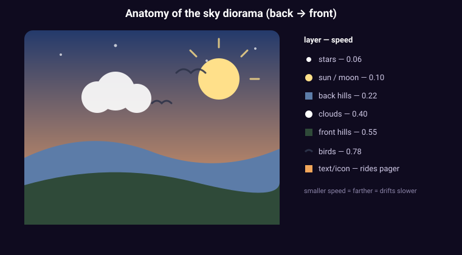
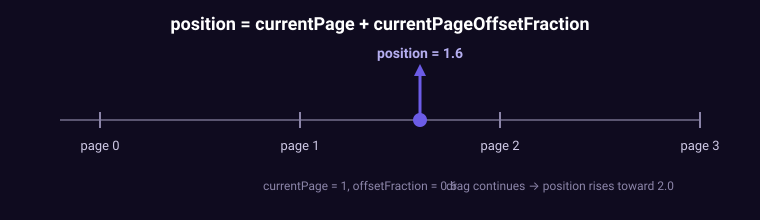
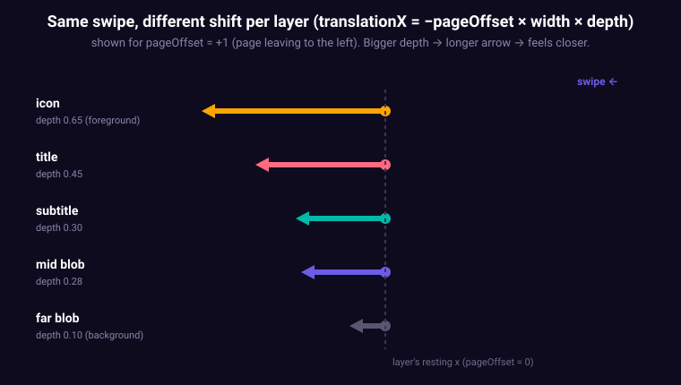
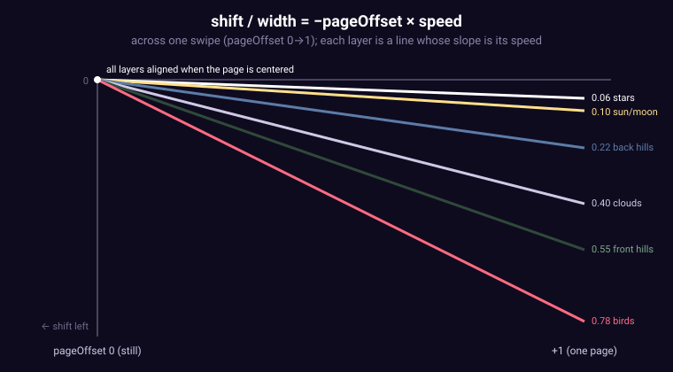
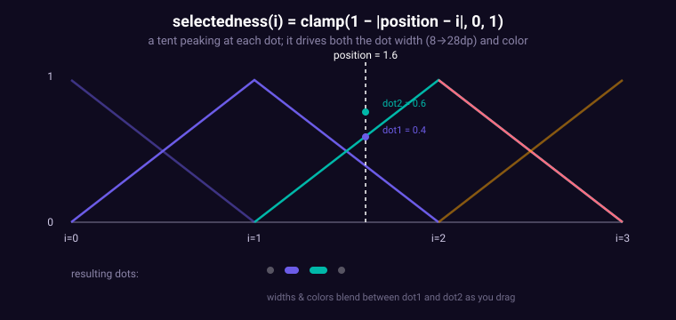

# Parallax Onboarding — per-page sky scenes

An onboarding flow where **each page is its own self-contained sky scene**
(dawn, day, sunset, night) and **all motion comes from the swipe** — nothing
animates on its own. Each page draws its own layers — stars, sun/moon, hills,
clouds, birds — and as you drag, those layers slide at *different paces*: near
layers move fast, far layers barely move. That difference is what your eye reads
as depth. At rest the whole scene is perfectly still.

Each page is clipped to its own bounds, so a page's birds/clouds never spill
into the neighbouring page — page 1 has its parallax, page 2 has its own, and so
on.

> Source: [`ParallaxOnboardingScreen.kt`](ParallaxOnboardingScreen.kt)



---

## 1. The master clock: `position`

`HorizontalPager` gives two values:

- `pagerState.currentPage` — the integer page it's settled on / closest to.
- `pagerState.currentPageOffsetFraction` — how far you've dragged, in fractions of a page, roughly `[-0.5, +0.5]`.

Add them for one continuous value across the flow:

```kotlin
val position = pagerState.currentPage + pagerState.currentPageOffsetFraction
```



`position` drives the *global* chrome — the page indicator and the button
accent color. The scenes themselves use a per-page version of it (next section).

---

## 2. `pageOffset`: each page measures its own distance from center

Inside the pager, every page is drawn by its own lambda. That page asks **how
far am *I* from the centered position?**

```kotlin
val pageOffset = { (pagerState.currentPage - page) + pagerState.currentPageOffsetFraction }
```

- `pageOffset == 0` → this page is dead center (fully on screen, at rest).
- `pageOffset == +1` → one page to the **left** (it's leaving).
- `pageOffset == -1` → one page to the **right** (waiting to enter).

Because each scene is keyed to *its own* `pageOffset`, the parallax is scoped to
that page: it plays as the page enters and leaves, and is completely still while
the page is centered.

---

## 3. The only motion: `shift = −pageOffset × width × speed`

Every layer is translated horizontally by its page offset times a per-layer
`speed` (a fraction of the page width):

```kotlin
fun shift(speed: Float) = -pageOffset() * size.width * speed
// e.g. star center = Offset(star.xf * w + shift(STAR_SPEED), star.yf * h)
```

| Layer | `speed` | Feel |
|-------|--------:|------|
| Stars | `0.06` | farthest — almost pinned to the sky |
| Sun / Moon | `0.10` | very distant |
| Back hills | `0.22` | distant ridge |
| Clouds | `0.40` | mid-air |
| Front hills | `0.55` | near ridge |
| Birds | `0.78` | closest scene layer — slide the most |



Plot the shift against `pageOffset` and each layer is a straight line through
the origin whose **slope is its speed** — same line, different steepness:



The perceived separation between any two layers is

```
Δshift = -pageOffset × width × (speed_A − speed_B)
```

— proportional to the **difference** in their speeds, and proportional to how
far the page has been dragged. At `pageOffset = 0` every term is zero, so all
layers line up and the scene is frozen; the depth only exists *while you swipe*.

> **Two things make this track the finger smoothly, with no recomposition:**
> 1. `pageOffset()` is a **lambda**, read *inside* the `Canvas` draw block — a
>    draw-time read, re-sampled every frame.
> 2. That read subscribes to `pagerState`, so the Canvas **invalidates and
>    repaints itself** whenever the swipe offset changes. (There is no infinite
>    transition — nothing redraws unless you're dragging.)

---

## 4. Per-page scenes (no global cross-fade)

Each page is just a config — its own sky colors, hill colors, and which elements
appear:

```kotlin
OnboardingPage(
    title = "Starry Night", icon = Icons.Filled.DarkMode, accent = …,
    skyTop = Color(0xFF070B1E), skyBottom = Color(0xFF202C54),
    moon = true, stars = true, birds = false, clouds = false, …
)
```

The scene reads those flags: sun **or** moon, stars only at night, birds/clouds
only when set. The sky is a vertical gradient drawn per-page inside the Canvas.
Because pages are independent and clipped, there's no shared "time of day"
math — page 0 simply *is* dawn and page 3 simply *is* night; the pager slides
one out and the next in.

Objects are scattered once (a seeded `Random`, keyed by page index so each page
differs) and then only ever moved by `shift(speed)`:

```kotlin
val birds = remember(seed) {
    val rnd = Random(seed * 53 + 9)
    List(5) { Bird(0.1f + rnd.nextFloat() * 0.8f, …) }   // fixed positions
}
```

---

## 5. Accent color interpolation (indicator + button)

The two global chrome elements still blend smoothly between pages, driven by
`position`:

```kotlin
fun colorBetweenPages(position, select): Color {
    val lower = position.toInt(); val upper = (lower + 1).coerceAtMost(lastIndex)
    return lerp(select(pages[lower]), select(pages[upper]), position - lower)
}
val accent = colorBetweenPages(position) { it.accent }
```

`lerp(a, b, t)` blends each channel `a + (b − a)·t`, so the indicator pill and
"Next" button glide through the page colors as you drag.

---

## 6. Foreground (the page content)

The icon, title and subtitle ride the pager (the closest "layer") plus a small
per-page parallax for life, using the same `pageOffset`:

```kotlin
Modifier.graphicsLayer {
    translationX = -pageOffset() * size.width * depth          // 0.20 / 0.10 / 0.05
    alpha = (1f - pageOffset().absoluteValue).coerceIn(0f, 1f)  // fade as page leaves
}
```

The icon (largest depth) drifts a touch more than the text, and the content
fades out as its page slides away.

---

## 7. The page indicator

Each dot's **selectedness** is a tent peaking at 1 when `position` lands on it:

```kotlin
val selectedness = (1f - (position - index).absoluteValue).coerceIn(0f, 1f)
val width = lerp(8.dp, 28.dp, selectedness)                            // stretches
val tint  = lerp(Color.White.copy(alpha = .3f), accent, selectedness)  // lights up
```



So the active "pill" flows between dots instead of snapping.

---

## TL;DR

```
position   = currentPage + currentPageOffsetFraction   // global: indicator + accent
pageOffset = position - page                           // per-page distance from center
shift      = -pageOffset * width * speed               // the ONLY motion (slope = speed)
accent     = lerp(pageA, pageB, fractional(position))  // chrome recolor
selected   = clamp(1 - |position - i|, 0, 1)           // indicator tent
```

Every page is its own scene, clipped to its bounds; the swipe is the single
input, and **depth is just the difference in how fast each layer answers it**.
Nothing moves on its own.
