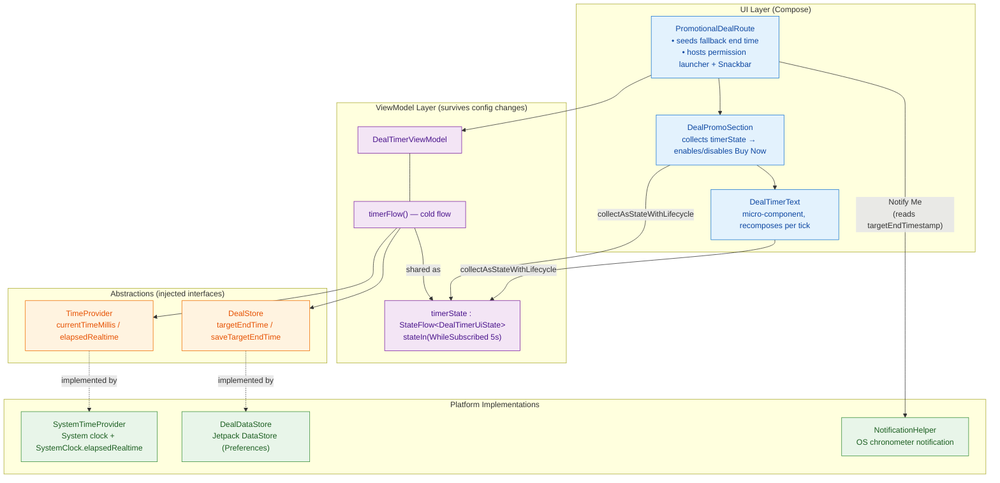
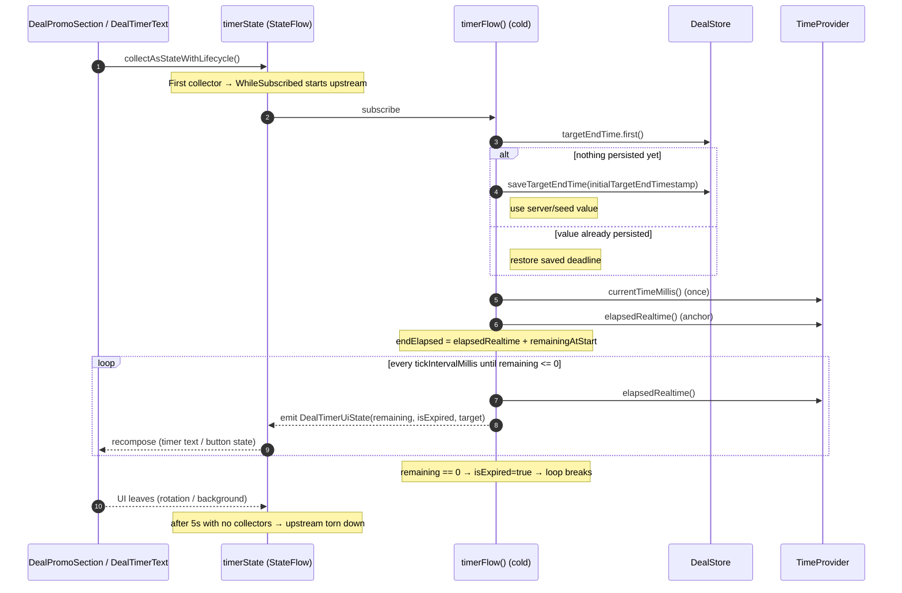
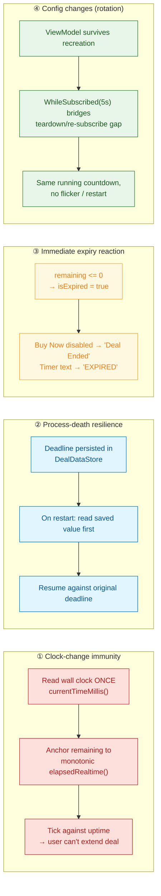
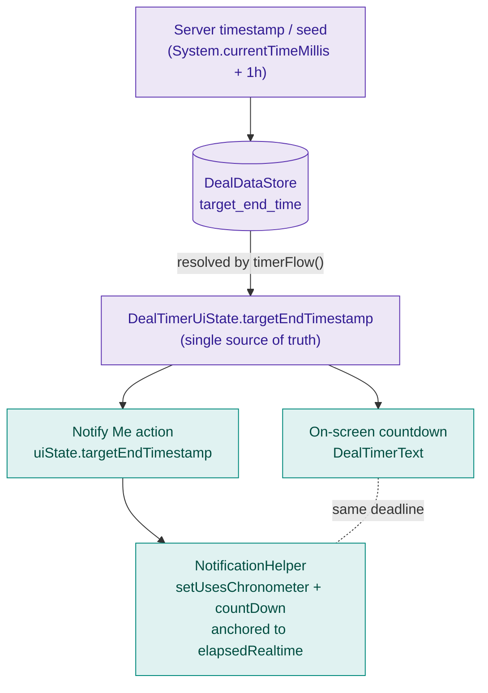

# Promotional Deal Timer — Architecture & Flow

Visual companion to [README.md](README.md). Diagrams use [Mermaid](https://mermaid.js.org/)
(rendered natively by GitHub and Android Studio's Markdown preview).

---

## 1. Component / Layer Architecture

How the pieces fit together and which way the dependencies point. The ViewModel depends on the
`TimeProvider` and `DealStore` **interfaces** (not the concrete classes) — that's what makes it
unit-testable on the JVM.

---

## 2. Startup & Tick Flow (cold flow + `WhileSubscribed`)

The countdown has **no `init` side effect and no `start()` call**. Collection by the UI starts the
upstream; the last collector leaving (after 5s grace) stops it.

---

## 3. Edge Cases — Why the Design Holds

---

## 4. Single Source of Truth for the Deadline

The notification must show the *same* countdown as the screen — across rotation **and** process
death. Both read the deadline that the ViewModel resolved from DataStore, never a Composable-local
value.

---

### Legend
- **Solid arrow** → runtime data/control flow.
- **Dashed arrow** → "implemented by" / "stays consistent with" relationship.
- **`( )` cylinder** → persisted storage (DataStore).
