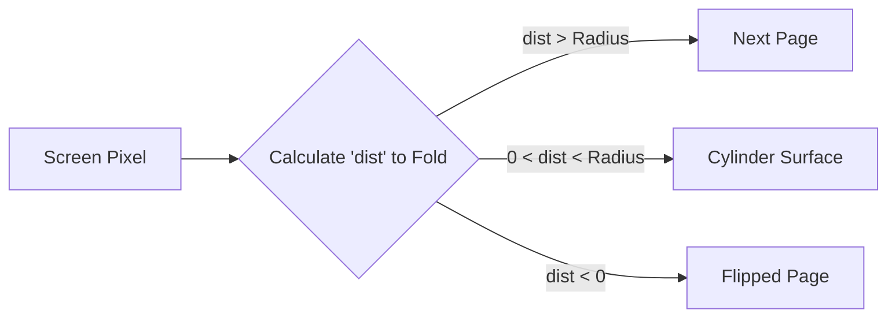
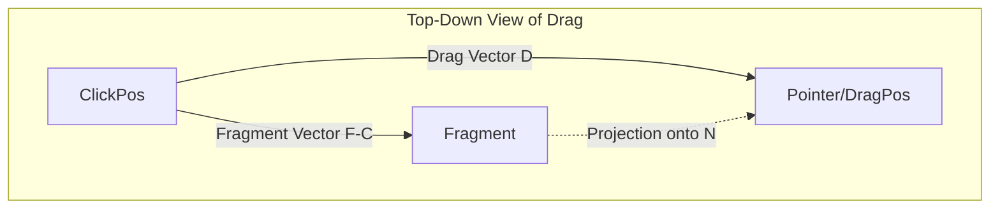
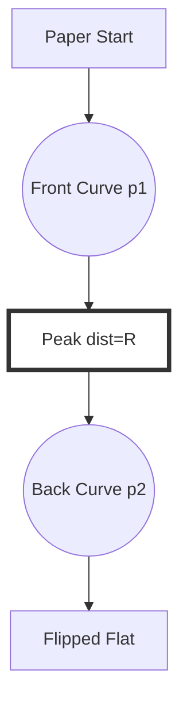
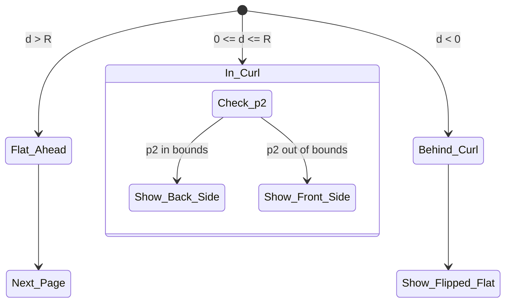

# Page Curl Shader: Mathematical Breakdown

This document breaks down the mathematics behind the **Cylindrical Page Curl** shader, based on the principles outlined in [Andrew Hung's blog](https://andrewhungblog.wordpress.com/2018/04/29/page-curl-shader-breakdown/).

---

## 1. The Core Concept: The Deforming Cylinder

Instead of moving vertices in 3D space, we simulate a 3D fold in a 2D fragment shader. Imagine the page is a flexible sheet being wrapped around a **virtual cylinder** that rolls across the screen.

### The Coordinate System
Every pixel (fragment) on the screen needs to decide which part of the "paper" it represents. To do this, we project the screen space into a 1D coordinate system relative to the **Fold Axis**.

---

## 2. Vector Geometry: Projection

To find where a pixel lies relative to the fold, we use the **Dot Product**.

1. **Drag Direction ($\vec{D}$):** The vector from where the user started clicking to where they are currently dragging.
2. **Normalized Normal ($\vec{N}$):** $\vec{N} = normalize(\vec{D})$.
3. **Projection ($d$):** For a fragment at position $\vec{F}$, its distance along the fold axis is:
   $$d = (\vec{F} - \vec{ClickPos}) \cdot \vec{N} - |\vec{D}|$$

This $d$ value tells us exactly how far "behind" or "ahead" of the cylinder's peak the pixel is.

---

## 3. The Cylinder Logic (Trigonometry)

When a pixel is "inside" the cylinder radius ($0 \leq d \leq R$), it represents a point on the curved surface.

### The "Unrolling" Math
Imagine the cylinder has a radius $R$. We find the angle $\theta$ of the fragment on that cylinder:
$$\theta = \arcsin(d / R)$$

Using this angle, we calculate the "arc length" (the distance if the paper were flat):

| Phase | Zone | Math | UV Result |
| :--- | :--- | :--- | :--- |
| **Expansion** | $d > R$ | $UV$ | Next Page (Revealed) |
| **Front Curve** | $0 \le d \le R$ | $p1 = Arc(d)$ | Current Page (Curving Up) |
| **Back Curve** | $0 \le d \le R$ | $p2 = Arc(PI-d)$ | Current Page (Flipped Down) |
| **Flat Flipped** | $d < 0$ | $p = Flat(d)$ | Current Page (Now Upside Down) |

---

## 5. Visualizing the Mapping

Here is how a 1D line of pixels is transformed:

## 6. Key Specifications

- **Radius ($R$):** Controls how "fat" the fold is.
- **Lighting:** We multiply the color by a factor of $pow(dist/R, 0.2)$ to simulate shadows and highlights as the paper curves away from the light source.
- **Aspect Ratio:** Since UVs are $0..1$, we must correct for the screen's aspect ratio (width/height) so the "circle" of the cylinder doesn't look like an oval.

---

### Replicating the Effect
To recreate this yourself:
1. Define your **Fold Line** (Normal and Offset).
2. For every fragment, find its distance to that line.
3. If distance is positive and less than Radius, use $\arcsin$ to "wrap" the UV.
4. If distance is negative, add the semi-circumference ($\pi R$) to the distance to "flip" the UV.
